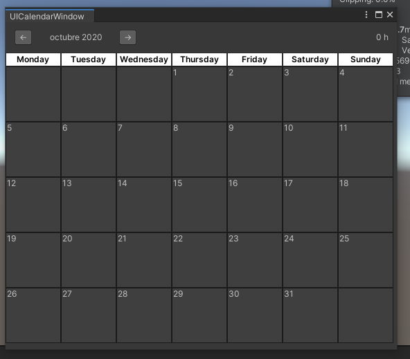
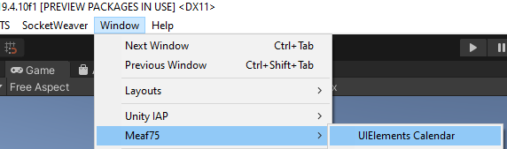
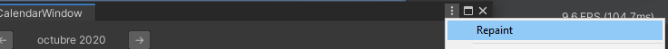

# Calendar-UIElements
Calendar window made with UIElements for Unity Editor

# Instructions/requirements

- Make sure only copy repo assets folder into your assets project
- Have installed UIElements package for unity

You can find the calendar window in Window/Meaf75/UIElements Calendar

# Extra info
- You can change between months with the arrow buttons located in the window header.
- Month name is displayed according user os language location.
- In case of try to repaint window, you can find a custom menu option into the 3 dots window button and force repaint.

